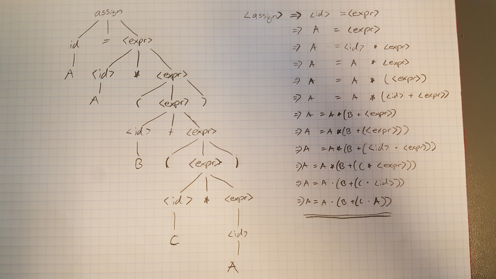

## Lecture 3

**Rewrite the BNF of Example 3.4 to give + precedence over * and force + to be right associative.**

we switch + with *. 

**Using the grammar in Example 3.2, show a parse tree and a leftmost derivation for each of the following statements:**
	**a. A = A * (B + (C * A))**

**Prove that the following grammar is ambiguous:**
**<S> → <A>**
**<A> → <A> + <A> | <id>**
**<id> → a | b | c**

2: Based on the grammar in Figure 2.1 construct the parse tree for each of the following:

a)  i x  x = 100  x = x + 30  p x

3: For each of the programs in exercise 2:

a) Construct the AST

b) c) "i x  x = x + y  p x"  Here the "y" is used but not declared before used. This is not allowed with the current CFG of the ac language.

## Lecture 4

Needed knowledge:

Extended Bakus Naur Form (EBNF):

- [WORD] - is optional parts
- ( + | - ) - Alternative parts are placed inside () and seperated with |
- {WORD} eller {+ | -} - Repetitions 0 - n
- ")" - I will be using " " for making a character not a part of the EBNF

EBNF example: `` <expr> → <term> {(+ | -) <term>}``  ``  <term> → <factor> {(* | /) <factor>}``

### Individual

4) Write EBNF descriptions for the following:

``Declaration -> [privacy-modifier] [final] [static] [const] (<returnType> | void)  <identifier>"("{<type> <identifier>} ")"`` 

a) A java class definition header statement

b) A java method call statement

``<methodCall> -> <identifier> "(" {<var> ,} ")" ;``

``<methodCall> -> <identifier> = <methodCall>``

``<methodCall> -> <type> <identifier> = <methodClass> ``

## Lecture 5

A grammar is ambiguous if one input can produce two trees.

### Individual 

2) For each of the grammars below, describe the language associated with the grammar and determine if the grammar is ambiguous. If the grammar is ambiguous show two parse trees for the same string, otherwise explain why the grammar is not ambiguous.

a) og b)

c) It was easiest to write with the rightmost derivation.  more??

A First($\alpha$) set, is a set of all terminal symbols that can begin a sentential form derivable from the string of grammar symbols in $\alpha$, formally: $Frist(\alpha)=\{ a \in \Sigma \; | \; \alpha \rightarrow * \; a \; \beta \}$

First(C) -> d = {d} DONT DONTKNPW